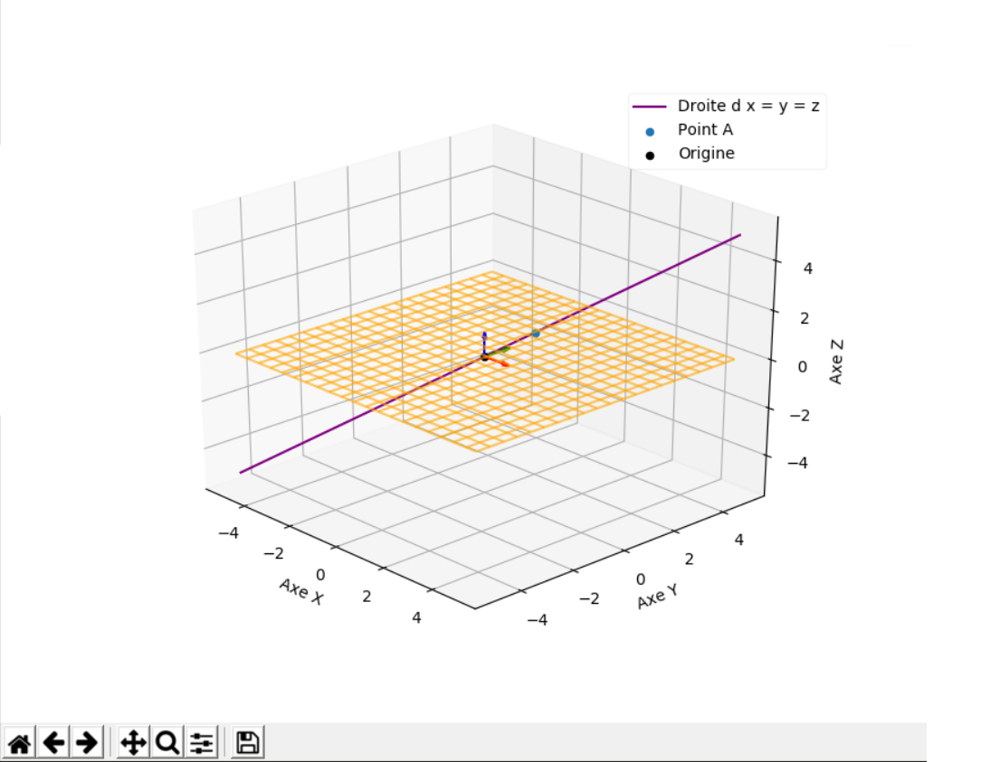

# Py3D

Un module python en français, qui vise à simplifier les programmes utilisants de la géométrie 2D ou 3D.

  Il vise à être utilisé par les <b>collégiens, lycéens et étudiants</b> afin de faciliter leurs projets ou leurs démonstration incluant de la géométrie 2D / 3D


Une documentation complète est disponible à cette adresse :<br>
[https://asionville.github.io/py3d/](https://asionville.github.io/py3d/)
  
## Installation

  Vous pouvez installer ce module en allant [ici](https://github.com/ASionville/py3d/releases) puis en téléchargeant le ZIP le plus récent.<br>
  Ensuite, vous n'avez plus qu'à dézipper le tout et à placer le dossier dans votre projet.
  
  >Un package *pip* pour une installation plus simple sera disponible à terme
  
  *Ce qui suit n'est pas nécessaire en installant py3d par pip*
  Vous aurez également besoin de ces deux modules : `matplotlib` et `numpy`.
  
  Pour les installer, ouvrez un terminal et tapez `pip install matplotlib numpy`<br>
  Pour ouvrir un terminal sur windows: Touche Windows puis `cmd`<br>
  Pour ouvrir un terminal sur linux: Application `Terminal`<br>
  Pour ouvrir un terminal sur mac: `ctr`+`shift`+`T`<br>
  

---
## Utilisation

  Nous nous baserons sur un dossier organisé comme ceci :
  
    .                           # Votre dossier de projet
    ├── py3d                    # Dossier py3d
    │   ├── droites.py
    │   ├── vecteurs.py
    │   └── ...
    ├── code1.py                 # Fichier de code 1
    ├── code2.py                 # Autre code
    └── ...


Nous recommandons de ne **pas** importer les fonctions de cette manière:
```python
from py3d import *
```

Mais plutôt de cette manière :
```python
import py3d
```
Cela évitera les possibles erreurs en utilisants d'autres modules (si vous n'en utilisez pas, alors c'est bon)
<br>

Exemple basique d'utilisation :
```python
import py3d

#Création de deux vecteurs u et v
u = py3d.Vecteur(0, 0, 1)
v = py3d.Vecteur(0, 0, 10)

#Est ce que les vecteurs sont collinéaires ? -> True
print(py3d.collineaires(u, v))
```

<br>

Exemple utilisant un graphique 3D :
```python
import py3d

#Création d'un point A de coordonnées (1, 1, 1)
pointA = py3d.Point(1, 1, 1)

#Création d'une droite passant par A et l'origine
d = py3d.Droite(py3d.origine, pointA)

#Création du plan z=0 (plan xy)
plan = py3d.plan_xy

#Création du repère 3D
repere = py3d.Repere3D()

#Ajout du plan divisé en une grille de 20x20
repere.ajouter(plan, grille=20)
#Ajout de la droite violette avec une étiquette
repere.ajouter(d,longueur=1, couleur="purple", label="Droite d x = y = z")
#Ajout du point A
repere.ajouter(pointA, label="Point A")

#Affichage du repère
repere.afficher()
```

Résultat :


<br>

D'autres exemples seront bientôt disponibles dans le dossier [exemples](exemples/)

---
## Gestion des bugs

Github possède un système de tickets (issues) sur lesquels nous pouvons discuter / s'entraîder disponibles ici : [Tickets](https://github.com/ASionville/py3d/issues)<br>
ou sinon, en haut de page

Merci à tous ceux que relèveront des bugs et qui m'en feront part, ils seront corrigés dès que possible

---
## Contact

Vous pouvez me contacter à cette adresse :
[aubin.sionville@stfrancoislaroche.fr](mailto:aubin.sionville@stfrancoislaroche.fr)
